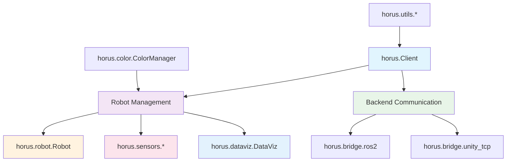

# API Reference

Complete API documentation for the HORUS Mixed Reality robot fleet management SDK.

## Overview

The HORUS SDK provides a comprehensive Python API for connecting ROS robots to the Mixed Reality fleet management system running on Meta Quest 3.

## SDK Architecture

The SDK is organized into focused modules for different aspects of robot fleet management:



## Module Overview

### Core SDK Components

| Module | Description | Key Classes |
|--------|-------------|-------------|
| **[horus.Client](client.md)** | Main SDK orchestrator and backend connection | `Client` |
| **[horus.robot](robot.md)** | Robot modeling and lifecycle management | `Robot`, `RobotType` |
| **[horus.sensors](sensors.md)** | Sensor integration and configuration | `Camera`, `Lidar3D`, `LaserScan` |
| **[horus.dataviz](dataviz.md)** | 3D data visualization for Mixed Reality | `DataViz` |
| **[horus.color](color.md)** | Multi-robot color management | `ColorManager` |
| **[horus.bridge](bridge.md)** | Communication adapters | `ROS2Bridge`, `UnityTCPBridge` |
| **[horus.utils](utils.md)** | Supporting utilities and helpers | `BackendManager`, `Spinner` |

## Quick Start

### Basic Robot Registration

```python
from horus import Client, Robot, RobotType
from horus.sensors import Camera, LaserScan

# Initialize SDK
client = Client(backend='ros2')

# Create robot
robot = Robot("my_robot", RobotType.WHEELED)

# Add sensors
camera = Camera("front_cam", "/camera/image_raw", "camera_link")
robot.add_sensor(camera)

# Create MR visualization
dataviz = robot.create_dataviz()

# Register with HORUS MR system
success, result = robot.register_with_horus(dataviz)
```

### Multi-Robot Fleet Management

```python
from horus import Client, Robot, RobotType
from horus.color import ColorManager

client = Client(backend='ros2')

# Create multiple robots
robots = [
    Robot("scout_01", RobotType.WHEELED),
    Robot("scout_02", RobotType.WHEELED),
    Robot("delivery_01", RobotType.AUTONOMOUS_VEHICLE)
]

# Each robot gets unique color automatically
for robot in robots:
    dataviz = robot.create_dataviz()
    robot.register_with_horus(dataviz)
```

## API Documentation Structure

### By Category

<div class="grid cards" markdown>

-   :material-api:{ .lg .middle } **Client API**

    ---

    Main SDK interface for backend connection and orchestration.

    [:octicons-arrow-right-24: Client Documentation](client.md)

-   :material-robot:{ .lg .middle } **Robot API**

    ---

    Robot creation, configuration, and lifecycle management.

    [:octicons-arrow-right-24: Robot Documentation](robot.md)

-   :material-radar:{ .lg .middle } **Sensors API**

    ---

    Sensor modeling, integration, and MR visualization.

    [:octicons-arrow-right-24: Sensors Documentation](sensors.md)

-   :material-chart-line:{ .lg .middle } **DataViz API**

    ---

    3D data visualization and Mixed Reality rendering.

    [:octicons-arrow-right-24: DataViz Documentation](dataviz.md)

-   :material-palette:{ .lg .middle } **Color API**

    ---

    Multi-robot color management and visual identification.

    [:octicons-arrow-right-24: Color Documentation](color.md)

-   :material-bridge:{ .lg .middle } **Bridge API**

    ---

    Communication adapters for ROS2 and Unity TCP.

    [:octicons-arrow-right-24: Bridge Documentation](bridge.md)

-   :material-tools:{ .lg .middle } **Utils API**

    ---

    Utilities, helpers, and supporting infrastructure.

    [:octicons-arrow-right-24: Utils Documentation](utils.md)

</div>

## Common Usage Patterns

### Robot Registration Pattern

```python
# Standard robot registration workflow
def register_robot(name: str, robot_type: RobotType):
    # 1. Create robot
    robot = Robot(name, robot_type)
    
    # 2. Configure sensors
    camera = Camera(f"{name}_camera", "/camera/image_raw", "camera_link")
    robot.add_sensor(camera)
    
    # 3. Create visualization
    dataviz = robot.create_dataviz()
    robot.add_path_planning_to_dataviz(dataviz, "/global_path", "/local_path")
    
    # 4. Register with MR system
    success, result = robot.register_with_horus(dataviz)
    
    return success, result
```

### Sensor Configuration Pattern

```python
# Comprehensive sensor setup
def configure_robot_sensors(robot: Robot):
    # Camera sensors
    front_camera = Camera("front_cam", "/front_camera/image_raw", "front_camera_link")
    rear_camera = Camera("rear_cam", "/rear_camera/image_raw", "rear_camera_link")
    
    # LiDAR sensors
    lidar_2d = LaserScan("lidar_2d", "/scan", "base_scan")
    lidar_3d = Lidar3D("lidar_3d", "/velodyne_points", "velodyne_link")
    
    # Add all sensors
    for sensor in [front_camera, rear_camera, lidar_2d, lidar_3d]:
        robot.add_sensor(sensor)
    
    return robot
```

### Error Handling Pattern

```python
from horus.core.exceptions import HorusSDKError, RobotRegistrationError

def safe_robot_registration(robot: Robot, dataviz: DataViz):
    try:
        success, result = robot.register_with_horus(dataviz)
        if success:
            print(f"✓ Robot registered: {result['robot_id']}")
            return result
        else:
            print(f"✗ Registration failed: {result['error']}")
            return None
    except RobotRegistrationError as e:
        print(f"✗ Registration error: {e}")
        return None
    except HorusSDKError as e:
        print(f"✗ SDK error: {e}")
        return None
```

## Type Definitions

### Core Types

```python
from typing import Dict, List, Optional, Tuple, Union
from enum import Enum

class RobotType(Enum):
    WHEELED = "wheeled"
    LEGGED = "legged"
    FLYING = "flying"
    AUTONOMOUS_VEHICLE = "autonomous_vehicle"
    CUSTOM = "custom"

class SensorType(Enum):
    CAMERA = "camera"
    LIDAR_2D = "lidar_2d"
    LIDAR_3D = "lidar_3d"
    IMU = "imu"
    GPS = "gps"
    CUSTOM = "custom"

# Registration result type
RegistrationResult = Dict[str, Union[str, int, bool]]

# Robot configuration type
RobotConfig = Dict[str, Union[str, int, List, Dict]]
```

### Method Signatures

```python
# Robot registration
def register_with_horus(
    self, 
    dataviz: DataViz
) -> Tuple[bool, RegistrationResult]:
    """Register robot with HORUS MR system."""

# Sensor addition
def add_sensor(
    self, 
    sensor: Union[Camera, LaserScan, Lidar3D, IMU, GPS]
) -> None:
    """Add sensor to robot configuration."""

# DataViz creation
def create_dataviz(
    self, 
    name: Optional[str] = None
) -> DataViz:
    """Create 3D visualization configuration."""
```

## Auto-Generated API Documentation

The complete API documentation is automatically generated from Python docstrings and type hints. Each module page includes:

- **Class Documentation**: Complete class definitions with methods and properties
- **Method Signatures**: Full type annotations and parameter descriptions
- **Usage Examples**: Real-world code examples for each major feature
- **Error Handling**: Exception types and error handling patterns
- **Cross-References**: Links to related classes and modules

## Examples and Tutorials

For practical usage examples, see:

- **[Getting Started](../getting-started/index.md)** - Basic SDK usage
- **[Examples](../examples/index.md)** - Comprehensive real-world examples
- **[User Guide](../user-guide/index.md)** - Feature-specific documentation

## Development and Contributing

To contribute to the API documentation:

1. **Update Docstrings**: Add Google-style docstrings to Python code
2. **Add Type Hints**: Include complete type annotations
3. **Write Examples**: Add usage examples to docstrings
4. **Test Documentation**: Verify examples work correctly

See the [Developer Guide](../developer-guide/index.md) for detailed contribution guidelines.

---

Navigate to specific API sections using the cards above, or explore the auto-generated documentation for complete details on all classes and methods.
