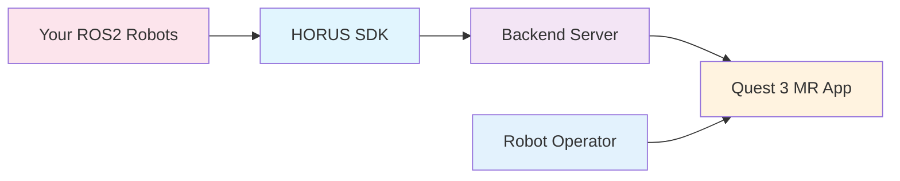

# Getting Started with HORUS

Welcome to HORUS SDK! This section will guide you through connecting your ROS robots to the HORUS Mixed Reality fleet management system.

## What is HORUS?

HORUS is a **Mixed Reality robot fleet management system** that runs on Meta Quest 3 headsets. It allows operators to:

- **Visualize multiple robots simultaneously** in immersive 3D environments
- **Control robot fleets spatially** through intuitive MR gestures and interfaces
- **Monitor real-time sensor data** with 3D overlays (cameras, LiDAR, telemetry)
- **Coordinate multi-robot missions** with spatial planning and visualization

## How the SDK Works

The HORUS SDK connects your ROS robots to the Quest 3 MR interface:

## Prerequisites

!!! warning "Quest 3 Required"
    HORUS is a **Mixed Reality system** that requires:
    
    - **Meta Quest 3 headset** with HORUS MR app installed
    - **ROS2 Humble** environment for robot connectivity
    - **Python 3.10+** for SDK development

## Quick Navigation

-   :material-clock-fast:{ .lg .middle } **Quick Start**

    ---

    Get your first robot connected to HORUS MR in 5 minutes.

    [:octicons-arrow-right-24: Quick Start](quickstart.md)

-   :material-download:{ .lg .middle } **Installation**

    ---

    Detailed setup instructions for different environments.

    [:octicons-arrow-right-24: Installation Guide](installation.md)

-   :material-robot:{ .lg .middle } **First Robot**

    ---

    Step-by-step tutorial for MR robot registration.

    [:octicons-arrow-right-24: First Robot](first-robot.md)

## What You'll Learn

### SDK Basics
- How to initialize the HORUS SDK and connect to the backend
- Robot modeling and sensor configuration for MR visualization
- Registration workflow for Quest 3 integration

### MR Integration
- Understanding the Quest 3 → Robot communication flow
- Real-time sensor data streaming to Mixed Reality
- Multi-robot fleet management with automatic color coding

### Advanced Features
- Custom robot types and sensor configurations
- Path planning visualization in 3D space
- Live connection monitoring and fleet status tracking

## Next Steps

Once you've completed the getting started guide, explore:

- **[User Guide](../user-guide/index.md)** - Comprehensive MR fleet management features
- **[Developer Guide](../developer-guide/index.md)** - Advanced SDK development
- **[API Reference](../api/index.md)** - Complete SDK API documentation
- **[Examples](../examples/index.md)** - Real-world robot integration demos
