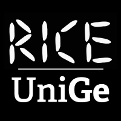

# HORUS SDK Documentation

<div align="center">


<h2><strong>Holistic Operational Reality for Unified Systems</strong></h2>

<em>Mixed Reality Robot Management SDK</em>

<p>
<a href="https://github.com/RICE-unige/horus_sdk/actions/workflows/ci.yml"></a>
<a href="https://github.com/RICE-unige/horus_sdk/actions/workflows/ci.yml"></a>
<a href="https://opensource.org/licenses/Apache-2.0"></a>
<a href="https://www.python.org/downloads/"></a>
<a href="https://docs.ros.org/en/humble/"></a>
</p>

</div>

---

## Welcome to HORUS SDK

HORUS SDK is the official toolkit that connects your ROS robot fleets to the **HORUS Mixed-Reality fleet management system** running on Meta Quest 3. The SDK enables robot registration, sensor integration, and real-time data streaming to create immersive 3D robot management experiences.

### 🎯 What is HORUS?

HORUS (Holistic Operational Reality for Unified Systems) is a **Mixed Reality robot fleet management system** that runs on Meta Quest 3 headsets. It transforms how operators interact with multiple robots by providing:

- **Immersive 3D robot visualization** with real-time sensor data overlay
- **Spatial robot control** through intuitive MR gestures and interfaces
- **Multi-robot coordination** with automatic color coding and identification
- **Live sensor fusion** displaying camera feeds, LiDAR, and telemetry in 3D space
- **Fleet-wide monitoring** with simultaneous robot status and mission tracking

## 🏗️ Architecture Overview

<div class="architecture-diagram" style="background: linear-gradient(135deg, #1a1a2e 0%, #16213e 50%, #0f3460 100%); padding: 1.5rem; border-radius: 12px; margin: 1.5rem 0; box-shadow: 0 8px 25px rgba(0,255,255,0.15); max-width: 800px; margin-left: auto; margin-right: auto;">

<div style="display: flex; flex-direction: column; align-items: center; gap: 1rem; color: white;">

<!-- Top Row: Fleet and SDK -->
<div style="display: flex; justify-content: center; gap: 1rem;">
    <div style="background: linear-gradient(135deg, #ff6b6b, #ee5a52); padding: 0.8rem; border-radius: 10px; text-align: center; width: 160px; box-shadow: 0 4px 12px rgba(255,107,107,0.25);">
        <div style="font-size: 1.8rem;">🤖</div>
        <strong style="font-size: 0.9rem;">ROS2 Robot Fleet</strong>
        <div style="font-size: 0.7rem; opacity: 0.8; margin-top: 0.3rem;">
            Physical Robots<br/>Sensor Systems
        </div>
    </div>
    
    <!-- Clear Arrow with Label -->
    <div style="display: flex; flex-direction: column; align-items: center; justify-content: center; margin: 0 0.5rem;">
        <div style="width: 0; height: 0; border-left: 8px solid transparent; border-right: 8px solid transparent; border-top: 12px solid #00ffff;"></div>
        <div style="background: #00ffff; color: #1a1a2e; padding: 0.2rem 0.5rem; border-radius: 4px; font-size: 0.7rem; font-weight: bold; margin: 0.2rem 0; white-space: nowrap;">ROS2 Topics</div>
        <div style="width: 0; height: 0; border-left: 8px solid transparent; border-right: 8px solid transparent; border-bottom: 12px solid #00ffff;"></div>
    </div>
    
    <div style="background: linear-gradient(135deg, #4ecdc4, #44a08d); padding: 0.8rem; border-radius: 10px; text-align: center; width: 160px; box-shadow: 0 4px 12px rgba(78,205,196,0.25);">
        <div style="font-size: 1.8rem;">⚡</div>
        <strong style="font-size: 0.9rem;">HORUS SDK</strong>
        <div style="font-size: 0.7rem; opacity: 0.8; margin-top: 0.3rem;">
            Python/C++ API<br/>Robot Management
        </div>
    </div>
</div>

<!-- Arrow Down to Backend -->
<div style="display: flex; flex-direction: column; align-items: center; margin: 0.5rem 0;">
    <div style="width: 0; height: 0; border-left: 10px solid transparent; border-right: 10px solid transparent; border-top: 15px solid #00ffff;"></div>
    <div style="background: #00ffff; color: #1a1a2e; padding: 0.3rem 0.8rem; border-radius: 5px; font-size: 0.8rem; font-weight: bold; margin: 0.3rem 0;">Port 8080</div>
    <div style="width: 0; height: 0; border-left: 10px solid transparent; border-right: 10px solid transparent; border-bottom: 15px solid #00ffff;"></div>
</div>

<!-- Backend -->
<div style="background: linear-gradient(135deg, #667eea, #764ba2); padding: 0.8rem; border-radius: 10px; text-align: center; width: 200px; box-shadow: 0 4px 12px rgba(102,126,234,0.25);">
    <div style="font-size: 1.8rem;">🔥</div>
    <strong style="font-size: 0.9rem;">HORUS Backend</strong>
    <div style="font-size: 0.7rem; opacity: 0.8; margin-top: 0.3rem;">
        C++ Engine • TCP Server
    </div>
</div>

<!-- Arrow Down to Endpoint -->
<div style="display: flex; flex-direction: column; align-items: center; margin: 0.5rem 0;">
    <div style="width: 0; height: 0; border-left: 10px solid transparent; border-right: 10px solid transparent; border-top: 15px solid #00ffff;"></div>
    <div style="background: #00ffff; color: #1a1a2e; padding: 0.3rem 0.8rem; border-radius: 5px; font-size: 0.8rem; font-weight: bold; margin: 0.3rem 0;">Port 10000</div>
    <div style="width: 0; height: 0; border-left: 10px solid transparent; border-right: 10px solid transparent; border-bottom: 15px solid #00ffff;"></div>
</div>

<!-- TCP Endpoint -->
<div style="background: linear-gradient(135deg, #96ceb4, #ffecd2); padding: 0.8rem; border-radius: 10px; text-align: center; width: 200px; box-shadow: 0 4px 12px rgba(150,206,180,0.25);">
    <div style="font-size: 1.8rem;">🌉</div>
    <strong style="font-size: 0.9rem; color: #333;">ROS-TCP-Endpoint</strong>
    <div style="font-size: 0.7rem; opacity: 0.8; margin-top: 0.3rem; color: #555;">
        Unity Bridge • Network Handler
    </div>
</div>

<!-- Arrow Down to MR Section -->
<div style="display: flex; flex-direction: column; align-items: center; margin: 0.5rem 0;">
    <div style="width: 0; height: 0; border-left: 10px solid transparent; border-right: 10px solid transparent; border-top: 15px solid #00ffff;"></div>
    <div style="background: #00ffff; color: #1a1a2e; padding: 0.3rem 0.8rem; border-radius: 5px; font-size: 0.8rem; font-weight: bold; margin: 0.3rem 0;">TCP Connection</div>
    <div style="width: 0; height: 0; border-left: 10px solid transparent; border-right: 10px solid transparent; border-bottom: 15px solid #00ffff;"></div>
</div>

<!-- Bottom Row: Operator and MR App -->
<div style="display: flex; justify-content: center; gap: 1rem; align-items: center;">
    <div style="background: linear-gradient(135deg, #ff9ff3, #f368e0); padding: 0.8rem; border-radius: 10px; text-align: center; width: 150px; box-shadow: 0 4px 12px rgba(255,159,243,0.25);">
        <div style="font-size: 1.8rem;">👨‍💼</div>
        <strong style="font-size: 0.9rem;">Robot Operator</strong>
        <div style="font-size: 0.7rem; opacity: 0.8; margin-top: 0.3rem;">
            Spatial Control
        </div>
    </div>
    
    <!-- Bidirectional Arrow -->
    <div style="display: flex; flex-direction: column; align-items: center; margin: 0 0.5rem;">
        <div style="background: #00ffff; color: #1a1a2e; padding: 0.2rem 0.4rem; border-radius: 3px; font-size: 0.6rem; font-weight: bold; margin-bottom: 0.2rem;">MR Interface</div>
        <div style="font-size: 1.5rem; color: #00ffff;">⟷</div>
    </div>
    
    <div style="background: linear-gradient(135deg, #feca57, #ff9f43); padding: 0.8rem; border-radius: 10px; text-align: center; width: 160px; box-shadow: 0 4px 12px rgba(254,202,87,0.25);">
        <div style="font-size: 1.8rem;">🥽</div>
        <strong style="font-size: 0.9rem;">HORUS MR App</strong>
        <div style="font-size: 0.7rem; opacity: 0.8; margin-top: 0.3rem;">
            Quest 3 Interface<br/>3D Visualization
        </div>
    </div>
</div>

</div>

</div>

### **System Flow:**

1. **🤖 ROS2 Robots** publish sensor data and receive commands via ROS2 topics

2. **⚡ HORUS SDK** interfaces with robot systems and manages registrations  

3. **🔥 Backend** processes data and maintains TCP server on port 8080

4. **🌉 TCP Endpoint** bridges ROS2 and Unity on port 10000

5. **🥽 Quest 3 App** provides immersive MR interface for robot control

6. **👨‍💼 Operators** interact spatially with robots in mixed reality

## 🚀 Quick Start

Get started with HORUS SDK in minutes:

### Prerequisites

!!! warning "Quest 3 Required"
    HORUS is a **Mixed Reality system** that requires a **Meta Quest 3 headset** with the HORUS MR app installed. The SDK connects your robots to this MR interface.

### Installation

=== "Quick Test (No Installation)"
    ```bash
    git clone --recursive https://github.com/RICE-unige/horus_sdk.git
    cd horus_sdk
    
    # Build ROS2 workspace
    cd horus_ros2_ws
    colcon build
    source install/setup.bash
    cd ..
    
    # Test SDK backend
    python3 examples/quick_test.py
    ```

=== "Full Installation"
    ```bash
    # Install SDK
    pip install -e python/
    
    # Build ROS2 workspace
    cd horus_ros2_ws
    colcon build
    source install/setup.bash
    
    # Run robot registration example
    python3 examples/carter_robot_setup.py
    ```

### Your First Robot

```python
from horus import Client, Robot, RobotType
from horus.sensors import Camera, LaserScan, Lidar3D
from horus.dataviz import DataViz

# Initialize HORUS SDK backend connection
client = Client(backend='ros2')

# Create a robot for MR visualization
robot = Robot(
    name="fleet_robot_01",
    robot_type=RobotType.WHEELED
)

# Add sensors that will appear in Quest 3
camera = Camera(
    name="front_camera",
    topic="/camera/image_raw",
    frame_id="camera_link"
)
lidar = Lidar3D(
    name="3d_lidar",
    topic="/lidar_points",
    frame_id="lidar_link"
)
robot.add_sensor(camera)
robot.add_sensor(lidar)

# Create 3D visualization for MR
dataviz = robot.create_dataviz()
robot.add_path_planning_to_dataviz(dataviz, "/global_path", "/local_path")

# Register robot with HORUS MR system
success, result = robot.register_with_horus(dataviz)
if success:
    print(f"✅ Robot registered with HORUS MR App!")
    print(f"   Quest 3 can now see robot: {result['robot_id']}")
    print(f"   MR Color: {result['assigned_color']}")
```

## 📚 Documentation Structure

<div class="grid cards" markdown>

-   :material-rocket-launch-outline:{ .lg .middle } **Getting Started**

    ---

    New to HORUS? Start here for installation, basic concepts, and your first robot setup.

    [:octicons-arrow-right-24: Quick Start](getting-started/quickstart.md)

-   :material-account-group:{ .lg .middle } **User Guide**

    ---

    Comprehensive guides for robot management, sensors, visualization, and Mixed Reality integration.

    [:octicons-arrow-right-24: User Guide](user-guide/index.md)

-   :material-code-braces:{ .lg .middle } **Developer Guide**

    ---

    Deep dive into plugin development, ROS integration, testing, and contributing to HORUS.

    [:octicons-arrow-right-24: Developer Guide](developer-guide/index.md)

-   :material-api:{ .lg .middle } **API Reference**

    ---

    Complete API documentation with examples for all HORUS SDK modules and classes.

    [:octicons-arrow-right-24: API Reference](api/index.md)

</div>

## ✨ Key Features

### Mixed Reality Fleet Management
- **Multi-robot visualization** in shared 3D space with automatic color coding
- **Real-time sensor fusion** displaying camera, LiDAR, and telemetry in MR
- **Spatial robot control** through Quest 3 gestures and interfaces
- **Live fleet monitoring** with simultaneous robot status tracking

### Professional SDK Architecture
- **Modular design** with dedicated robot, sensor, and visualization modules
- **Type-safe** Python implementation with comprehensive validation
- **ROS2 integration** for seamless robot system connectivity
- **Extensible plugin system** for custom robot types and sensors

### Quest 3 Optimization
- **Native TCP communication** for low-latency MR experience
- **Real-time connection monitoring** with automatic Quest 3 detection
- **3D sensor visualization** with point clouds, camera feeds, and paths
- **Immersive robot control** through spatial MR interfaces

### Production-Ready Framework
- **Comprehensive testing** with CI/CD integration and validation
- **Professional initialization** with animated status and connection monitoring
- **Robust error handling** with graceful connection management
- **Clean process lifecycle** with automatic backend management

## 🎯 Current Status

**Version: 0.1.0-alpha**

| Component | Status | Description |
|-----------|--------|-------------|
| Python SDK | ✅ Working | Robot registration and sensor integration |
| C++ Backend | ✅ Working | ROS2 node with TCP server for MR communication |
| Quest 3 Integration | ✅ Working | Real-time MR app connection via TCP bridge |
| Robot Examples | ✅ Working | Carter robot and multi-robot fleet demos |
| Documentation | 🚧 In Progress | This documentation site |
| HORUS MR App | 🚧 In Development | Quest 3 Mixed Reality interface |
| Plugin System | 📋 Planned | Extensible robot type plugins |

## 🤝 Community & Support

### Getting Help

- **Documentation**: You're reading it! Check the [User Guide](user-guide/index.md) and [API Reference](api/index.md)
- **GitHub Issues**: [Report bugs or request features](https://github.com/RICE-unige/horus_sdk/issues)
- **Discussions**: [Join the community discussions](https://github.com/RICE-unige/horus_sdk/discussions)

### Contributing

HORUS SDK is open source and welcomes contributions! See our [Contributing Guide](developer-guide/contributing.md) to get started.

### Research & Citation

HORUS SDK is developed at the **RICE Lab**, University of Genoa. If you use HORUS in academic work, please cite:

<div align="left" style="margin: 20px 0;">
  <a href="https://rice.dibris.unige.it/" target="_blank">
    
  </a>
  <a href="https://unige.it/en" target="_blank">
    
  </a>
</div>

```bibtex
@misc{adekoya2025horus,
  title   = {HORUS: A Mixed Reality Interface for Managing Teams of Mobile Robots},
  author  = {Adekoya, Omotoye Shamsudeen and Sgorbissa, Antonio and Recchiuto, Carmine T.},
  year    = {2025},
  eprint  = {2506.02622},
  archivePrefix = {arXiv},
  primaryClass  = {cs.RO}
}
```

---

<div align="center">
  <p><strong>Ready to build amazing robot experiences in Mixed Reality?</strong></p>
  <a href="getting-started/quickstart.md" class="md-button md-button--primary">Get Started Now</a>
  <a href="https://github.com/RICE-unige/horus_sdk" class="md-button">View on GitHub</a>
</div>
