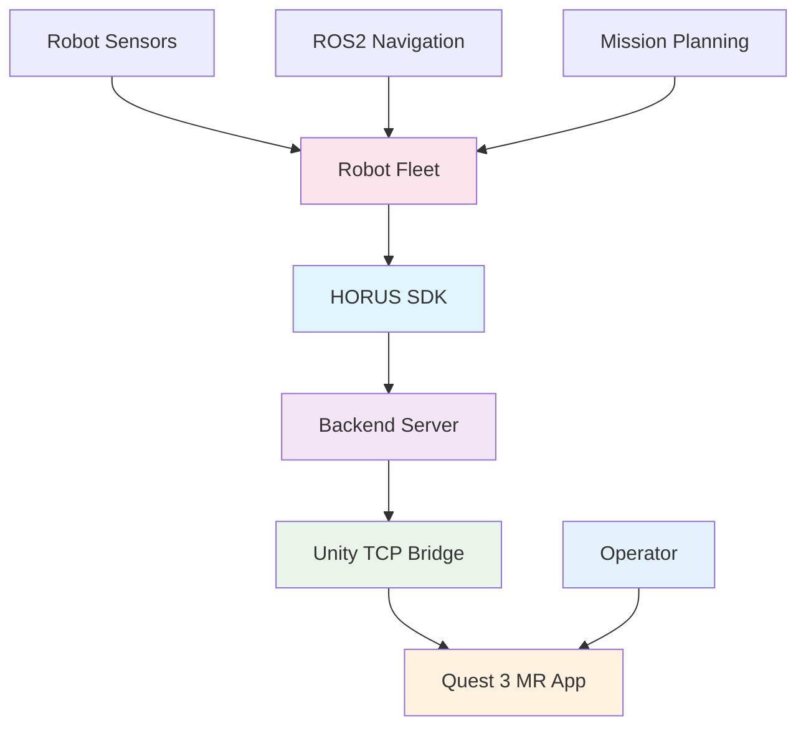

# User Guide

Welcome to the HORUS Mixed Reality robot fleet management system user guide. This comprehensive guide covers all aspects of managing robot fleets through Quest 3.

## Overview

HORUS transforms robot fleet management by providing immersive Mixed Reality interfaces on Meta Quest 3. This guide covers everything from basic robot operations to advanced multi-robot coordination.

## What You'll Learn

This user guide covers all key aspects of HORUS MR fleet management:

### 📋 **Guide Sections** *(Coming Soon)*

- **🏗️ System Architecture** - Understanding HORUS system architecture and data flow from robots to MR
- **🤖 Robot Management** - Complete guide to robot registration, configuration, and lifecycle management  
- **📡 Sensor Integration** - Sensor integration, configuration, and 3D visualization in Mixed Reality
- **📊 Data Visualization** - Advanced 3D data visualization, real-time streaming, and MR overlays
- **🎨 Color Management** - Multi-robot fleet color coding and visual identification systems
- **🥽 Mixed Reality Interface** - Quest 3 interface, spatial controls, and immersive robot interaction

!!! info "Documentation Status"
    The detailed user guide sections are currently being developed. For now, explore the [Getting Started](../getting-started/index.md) guides and [API Reference](../api/index.md).

## Core Concepts

### Mixed Reality Fleet Management

HORUS provides unprecedented spatial awareness for robot fleet operations:

- **3D Robot Visualization**: See all robots in shared 3D space with real-time positioning
- **Sensor Data Fusion**: Live camera feeds, LiDAR point clouds, and telemetry overlays
- **Spatial Control**: Intuitive gesture-based robot control and mission planning
- **Fleet Coordination**: Multi-robot task assignment and coordination visualization

### System Components

## Getting Started

### Prerequisites

Before diving into the user guide, ensure you have:

- **Quest 3 Setup**: HORUS MR app installed and configured
- **SDK Installation**: HORUS SDK installed and tested
- **Robot Systems**: ROS2 robots with basic navigation capabilities

### Quick Start Checklist

- [ ] Complete [Installation Guide](../getting-started/installation.md)
- [ ] Test robot connection with [First Robot](../getting-started/first-robot.md)
- [ ] Review [Quick Start Guide](../getting-started/quickstart.md)
- [ ] Explore [API Reference](../api/index.md) for detailed SDK usage

## Advanced Topics

### Multi-Robot Coordination

HORUS excels at managing multiple robots simultaneously:

- **Fleet Visualization**: See all robots in shared MR space
- **Automatic Color Coding**: Each robot gets unique visual identity
- **Coordinated Planning**: Multi-robot path planning and task assignment
- **Real-time Monitoring**: Live status of entire fleet

### Production Deployment

For production environments, HORUS provides:

- **Robust Connection Management**: Automatic reconnection and error handling
- **Scalable Architecture**: Support for large robot fleets
- **Performance Optimization**: Low-latency MR visualization
- **Security Features**: Encrypted communication and access control

## Support and Community

### Getting Help

- **Documentation**: Start with this user guide and [API Reference](../api/index.md)
- **Examples**: Explore [comprehensive examples](../examples/index.md)
- **GitHub Issues**: Report bugs and request features
- **Community**: Join discussions and share experiences

### Contributing

HORUS is open source and welcomes contributions:

- **Bug Reports**: Help improve stability and reliability
- **Feature Requests**: Suggest new MR capabilities
- **Code Contributions**: Submit pull requests for enhancements
- **Documentation**: Help improve guides and tutorials

## What's Next?

Choose your path based on your needs:

### For New Users
1. **[Getting Started](../getting-started/index.md)** - Installation and basic setup
2. **[First Robot](../getting-started/first-robot.md)** - Your first robot integration
3. **[Quick Start](../getting-started/quickstart.md)** - Complete walkthrough

### For Advanced Users
1. **[API Reference](../api/index.md)** - Complete SDK documentation
2. **[Examples](../examples/index.md)** - Real-world implementations
3. **GitHub Repository** - Latest source code and issues

### For Developers
1. **[API Reference](../api/index.md)** - Complete API documentation
2. **[Examples](../examples/index.md)** - Integration examples
3. **GitHub Issues** - Report bugs and request features

---

Ready to explore HORUS Mixed Reality robot fleet management? Choose a section above to begin your journey into the future of robot operations!
